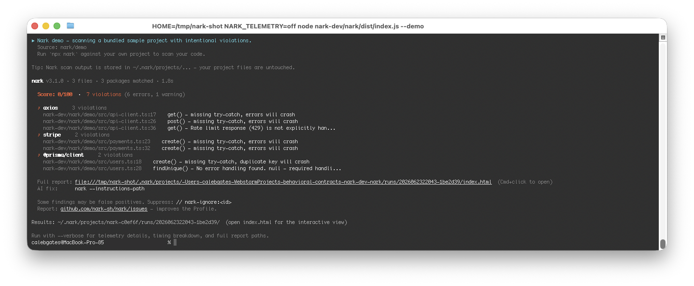

<p align="center">
  <!-- Logo: aardvark mark + NARK wordmark, transparent PNG or SVG.
       Target: ~120px tall on retina (so export at 240px or use SVG).
       Source: lift the brand mark from the nark.sh hero. -->
  
</p>

# nark

**Profile coverage scanner for npm packages — find missing error handling before production.**

nark scans your TypeScript codebase against a curated library of 169+ package profiles to find places where error handling is missing. Think of it as a linter, but for runtime failure modes — unhandled promise rejections, missing `.on('error')` listeners, uncaught API exceptions.

<p align="center">
  <!-- Violation output: screenshot of `npx nark --demo` showing 3-5 violations
       with severity badge, file:line, postcondition id, and fix hint.
       Target: 1440px wide @ 2x retina (so export at ~2880px). Crop to the
       violation block — do NOT include the install spinner / npm warnings. -->
  
</p>

[](https://www.npmjs.com/package/nark)
[](https://socket.dev/npm/package/nark)
[](https://scorecard.dev/viewer/?uri=github.com/nark-sh/nark)
[](https://nark.sh/status)
[](https://www.gnu.org/licenses/agpl-3.0)

## Verify this yourself

We try to replace "trust me" with "here, verify." Every claim below points at something you can re-check on your own machine or from a third-party page we do not control:

- **Source you can read.** Repo at https://github.com/nark-sh/nark — AGPL-3.0, no closed-source binary.
- **Provenance attestation.** Published with `npm publish --provenance` via [npm Trusted Publishing](https://docs.npmjs.com/trusted-publishers/). The green Provenance badge on the [npm page](https://www.npmjs.com/package/nark) cryptographically links the published tarball to the exact git commit and CI run. Verify any installed copy with `npm audit signatures`.
- **Third-party supply-chain score.** Continuously scored by [Socket](https://socket.dev/npm/package/nark). We don't submit anything — Socket scans every published version automatically.
- **Third-party project-health score.** [OpenSSF Scorecard](https://scorecard.dev/viewer/?uri=github.com/nark-sh/nark) re-runs weekly against the public repo. Anyone can re-derive the score from scratch.
- **Score history.** Daily-updated Socket score timeline at https://nark.sh/status — every entry is committed to a public workflow log.
- **What ships in the tarball.** Run `npm pack --dry-run nark` — you'll see only `bin/`, `dist/`, `schema/`, `demo/`, `FORAIAGENTS.md`. Nothing else.
- **No install scripts.** `npm install nark --ignore-scripts` produces an identical install. nark runs zero code on your machine at install time.
- **Telemetry, in full detail.** Schema, endpoint, and the three opt-out paths documented at https://nark.sh/telemetry. See [Telemetry](#telemetry) below.
- **Responsible disclosure.** [SECURITY.md](./SECURITY.md) — 48h acknowledgement, security@nark.sh.

## Honest about false positives

Nark uses static analysis. Static analysis is an approximation — the scanner reasons
about code without running it, so some flagged violations may be false positives if
your project handles errors at a layer Nark cannot see yet: a central Express or
NestJS error middleware, a React error boundary, a retry wrapper one frame up, a
try-catch in the calling function, or a library that catches internally.

What we do to keep the rate honest:

- **Profiles are evidence-based.** Every postcondition cites the package's
  documentation or source code. We do not invent rules.
- **The scanner recognizes common framework patterns.** It understands TanStack
  Query global handlers, TanStack Router loader callbacks, tRPC callback wrappers,
  Fastify `setErrorHandler`, Express and Koa error middleware, NestJS exception
  filters, and several other architectural patterns. The list grows monthly.
- **We measure before we ship.** Every scanner upgrade is verified against real
  codebases before release.

If you see a false positive: suppress with `// nark-ignore: <postcondition-id>` next
to the line, or open an issue at
[github.com/nark-sh/nark/issues](https://github.com/nark-sh/nark/issues) with the
file:line — we update the Profile or scanner from real reports. We do not claim
the scanner is perfect. We claim it is honest about what it knows and what it does
not.

## Quick Start

### Try it in 60 seconds (no setup)

```bash
npx nark --demo
```

This runs Nark against a bundled sample project with intentional `axios`, `stripe`, and `@prisma/client` violations. The output is exactly what a real scan against your own code looks like — just with a guaranteed non-empty report.

Run with `--verbose` to see per-violation detail (code snippets, sources, and fix guidance) plus repository health metrics:

<details>
<summary><strong>Show verbose Verification Report</strong> (per-violation detail with code snippets)</summary>

```
Nark Verification Report
────────────────────────────────────────────────────────────────────────────────

Summary:
  Files analyzed: 3
  Contracts applied: 3
  Timestamp: 2026-06-23T23:18:02.014Z
  Git commit: c170802b (dirty)
  Git branch: main

Package Discovery & Coverage
────────────────────────────────────────────────────────────────────────────────

  Total packages: 3
  Packages with contracts: 3 (100.0%)
  Packages without contracts: 0

  ✓ Packages with contracts:
    @prisma/client@* (contract v1.1.0)
    axios@* (contract v1.0.0)
    stripe@* (contract v1.0.0)

Violations by Package
────────────────────────────────────────────────────────────────────────────────

@prisma/client (2 violations)
  Errors: 2 | Warnings: 0 | Info: 0

  ✗ nark-dev/nark/demo/src/users.ts:18:22
    No try-catch block found. PrismaClientKnownRequestError with code 'P2002' - this will crash the application.
    Package: @prisma/client.create()
    Contract: unique-constraint-violation

      14 | // throws Prisma's P2002 unique-constraint error. The caller sees a generic
      15 | // rejection and a 500 — the user sees "something went wrong" instead of
      16 | // "this email is already registered."
      17 | export async function createUser(email: string, name: string) {
    > 18 |   const user = await prisma.user.create({ data: { email, name } });
      19 |   return user;
      20 | }
      21 | 
      22 | // Looks up a user by email.
    Also fix in same handler:
      ↳ Also missing: PrismaClientKnownRequestError with code 'P2003'
      ↳ Also missing: PrismaClientValidationError
      ↳ Also missing: PrismaClientInitializationError or PrismaClientRustPanicError
    Fix: Caller MUST catch P2002 errors and handle duplicate key violations gracefully. Extract conflicting field from error.meta.target. DO NOT retry without changing the unique field value.
    Docs: https://www.prisma.io/docs/reference/api-reference/error-reference#p2002

  ✗ nark-dev/nark/demo/src/users.ts:28:22
    No error handling found. null — required handling missing.
    Package: @prisma/client.findUnique()
    Contract: record-not-found

      24 | // reject on connection-pool exhaustion, statement-timeout, or a transient
      25 | // network blip to the database. Without handling, a slow query during
      26 | // peak traffic crashes the request instead of returning a graceful 503.
      27 | export async function getUserByEmail(email: string) {
    > 28 |   const user = await prisma.user.findUnique({ where: { email } });
      29 |   return user;
      30 | }
      31 | 
    Also fix in same handler:
      ↳ Also missing: PrismaClientInitializationError
    Fix: Caller MUST check if result is null before accessing properties. Code that assumes findUnique always returns a record will crash.
    Docs: https://www.prisma.io/docs/concepts/components/prisma-client/crud#findunique

axios (3 violations)
  Errors: 2 | Warnings: 1 | Info: 0

  ✗ nark-dev/nark/demo/src/api-client.ts:17:26
    No try-catch block found. AxiosError with error.response containing the error response - this will crash the application.
    Package: axios.get()
    Contract: error-4xx-5xx

      13 | // VIOLATION (axios.error-4xx-5xx): no try/catch — a 404 or a network blip
      14 | // rejects the promise, the caller sees an unhandled rejection, and depending
      15 | // on the Node version the process may exit.
      16 | export async function fetchUserProfile(userId: string) {
    > 17 |   const response = await axios.get(`${API_BASE}/users/${userId}`);
      18 |   return response.data;
      19 | }
      20 | 
      21 | // Submits a comment to the upstream service.
    Also fix in same handler:
      ↳ Also missing: AxiosError with error.response.status === 429
      ↳ Also missing: AxiosError with error.request populated but error.response === undefined
      ↳ Also missing: AxiosError with both error.request === undefined and error.response === undefined
    Fix: Caller MUST catch AxiosError and check error.response.status to distinguish between client errors (4xx) and server errors (5xx).
    Docs: https://axios-http.com/docs/handling_errors

  ✗ nark-dev/nark/demo/src/api-client.ts:26:26
    No try-catch block found. AxiosError with error.response - this will crash the application.
    Package: axios.post()
    Contract: error-4xx-5xx

      22 | // VIOLATION (axios.error-4xx-5xx): same shape as above, but on a POST —
      23 | // even more dangerous because retrying naively could double-post the
      24 | // comment without an idempotency key.
      25 | export async function postComment(userId: string, text: string) {
    > 26 |   const response = await axios.post(`${API_BASE}/comments`, { userId, text });
      27 |   return response.data;
      28 | }
      29 | 
      30 | // Fetches search results.
    Also fix in same handler:
      ↳ Also missing: AxiosError with error.response.status === 429
      ↳ Also missing: AxiosError with error.response === undefined
    Fix: Caller MUST catch AxiosError and inspect error.response.status
    Docs: https://axios-http.com/docs/handling_errors

  ⚠ nark-dev/nark/demo/src/api-client.ts:36:28
    Rate limit response (429) is not explicitly handled. Consider implementing retry logic with exponential backoff.
    Package: axios.get()
    Contract: rate-limited-429

      32 | // only logs and re-throws. A 429 from a rate-limited API should trigger a
      33 | // backoff/retry; here it just bubbles up as a generic "request failed."
      34 | export async function searchPosts(query: string) {
      35 |   try {
    > 36 |     const response = await axios.get(`${API_BASE}/search`, {
      37 |       params: { q: query },
      38 |     });
      39 |     return response.data;
      40 |   } catch (error) {
    Fix: Caller MUST either: 1. Implement exponential backoff retry logic with the Retry-After header, OR 2. Explicitly handle 429 as a terminal error and surface to the user, OR 3. Use a request queue that respects rate limits. Silently catching and ignoring 429 without retry logic is a violation.
    Docs: https://axios-http.com/docs/handling_errors

stripe (2 violations)
  Errors: 2 | Warnings: 0 | Info: 0

  ✗ nark-dev/nark/demo/src/payments.ts:23:24
    No try-catch block found. StripeCardError with error.type === 'card_error' - this will crash the application.
    Package: stripe.create()
    Contract: card-error

      19 |   amount: number,
      20 |   currency: string,
      21 |   source: string,
      22 | ) {
    > 23 |   const charge = await stripe.charges.create({ amount, currency, source });
      24 |   return charge.id;
      25 | }
      26 | 
      27 | // Creates a new Stripe customer record at signup time.
    Also fix in same handler:
      ↳ Also missing: StripeRateLimitError with error.type === 'rate_limit_error'
      ↳ Also missing: StripeAuthenticationError with error.type === 'authentication_error'
      ↳ Also missing: Error with no error.type (connection error)
    Fix: Caller MUST catch StripeCardError and handle gracefully. Display user-friendly message based on error.decline_code. DO NOT retry card_error without user intervention.
    Docs: https://stripe.com/docs/error-handling

  ✗ nark-dev/nark/demo/src/payments.ts:32:26
    No try-catch block found. StripeCardError with error.type === 'card_error' - this will crash the application.
    Package: stripe.create()
    Contract: card-error

      28 | // VIOLATION (stripe.error-4xx-5xx): no try/catch on the customer.create.
      29 | // A duplicate-email collision or a transient 502 from Stripe will throw
      30 | // and the signup flow will appear to silently fail.
      31 | export async function registerCustomer(email: string) {
    > 32 |   const customer = await stripe.customers.create({ email });
      33 |   return customer.id;
      34 | }
      35 | 
    Also fix in same handler:
      ↳ Also missing: StripeRateLimitError with error.type === 'rate_limit_error'
      ↳ Also missing: StripeAuthenticationError with error.type === 'authentication_error'
      ↳ Also missing: Error with no error.type (connection error)
    Fix: Caller MUST catch StripeCardError and handle gracefully. Display user-friendly message based on error.decline_code. DO NOT retry card_error without user intervention.
    Docs: https://stripe.com/docs/error-handling

────────────────────────────────────────────────────────────────────────────────

Overall Summary:
  Total violations: 7
  Errors: 6
  Warnings: 1
  Info: 0

✗ FAILED


╔═══════════════════════════════════════════════════════════════════════════════╗
```

</details>

<details>
<summary><strong>Show verbose Analysis Report</strong> (coverage summary, health metrics, recommendations)</summary>

```
║                         Nark Analysis Report                                  ║
╚═══════════════════════════════════════════════════════════════════════════════╝

Repository: demo
Analyzed: 6/23/2026, 7:18:02 PM
Git Commit: c170802b
Git Branch: main

✅ CODE HEALTH SCORE: 0/100

📊 COVERAGE SUMMARY
────────────────────────────────────────────────────────────────────────────────
  • Files Analyzed: 3
  • Call Sites Evaluated: 7
  • Contracts Applied: 3
  • Violations Found: 7 !
  • Checks Passed: 0 ✓

📈 REPOSITORY HEALTH METRICS
────────────────────────────────────────────────────────────────────────────────
  • Error Handling Compliance: 0%
  • Package Coverage: 100%
  • Code Maturity: LOW
  • Risk Level: HIGH


✗ VIOLATIONS BY PACKAGE
────────────────────────────────────────────────────────────────────────────────
  ✗ axios                           3 violations in 3 call sites  (2 errors, 1 warnings)
  ✗ @prisma/client                  2 violations in 2 call sites  (2 errors)
  ✗ stripe                          2 violations in 2 call sites  (2 errors)

  3 packages with contracts checked
  0 fully compliant ✓
  3 with violations ✗

🎯 RECOMMENDATIONS
────────────────────────────────────────────────────────────────────────────────
  1. Fix 7 remaining violations to achieve 100% compliance
  2. Run scan after fixes to verify improvements
  3. Add to CI to prevent future violations

════════════════════════════════════════════════════════════════════════════════
  Report generated by Nark v3.2.0
  Next scan: Enable CI integration for continuous monitoring
════════════════════════════════════════════════════════════════════════════════
```

</details>

### Or build from source

```bash
# Clone nark and the contract corpus side by side
git clone https://github.com/nark-sh/nark.git
git clone https://github.com/nark-sh/nark-corpus.git

# Build
cd nark
npm install
npm run build

# Verify it works by scanning nark itself
node bin/nark.js --tsconfig ./tsconfig.json --corpus ../nark-corpus

# Then scan your own project
node bin/nark.js --tsconfig /path/to/your/project/tsconfig.json --corpus ../nark-corpus
```

Scanning nark's own repo is a good smoke test — you should see a clean report with 0 violations and a handful of contracted packages detected.

If your project doesn't have a `tsconfig.json`, nark will generate a minimal one automatically.

If `nark-corpus` is installed as an npm package, nark finds it automatically — no `--corpus` flag needed.

## Add to Your Project

Install nark as a dev dependency so your whole team runs it:

```bash
npm install --save-dev nark
# or
pnpm add -D nark
```

Add a script to your `package.json`:

```json
{
  "scripts": {
    "nark": "nark"
  }
}
```

Then scan with:

```bash
npm run nark
# or just
pnpm nark
```

For CI, fail the build on violations:

```bash
pnpm nark --fail-threshold warning
```

## What It Finds

nark knows how 169+ npm packages fail at runtime. For each one, it checks that your code handles those failures. Example violations:

```
ERROR  axios.get() call without try-catch
  → src/api/client.ts:42
  Contract: axios → postcondition "network-error-handling"
  Fix: Wrap in try-catch and handle AxiosError

WARN   redis.connect() without .on('error') listener
  → src/cache/redis.ts:18
  Contract: ioredis → postcondition "connection-error-listener"
  Fix: Register error listener before calling connect()
```

## How It Works

1. **Contracts** define how packages fail (what errors they throw, what events they emit)
2. **Scanner** walks your TypeScript AST and finds calls to contracted packages
3. **Analyzer** checks if each call site has appropriate error handling
4. **Reporter** outputs violations with severity, location, and fix suggestions

Contracts are YAML files in the [nark-corpus](https://github.com/nark-sh/nark-corpus) package. The scanner uses TypeScript's compiler API — no runtime execution.

## Output

Results go to `.nark/` in your project directory:

```
.nark/
├── config.yaml              # Scanner configuration
├── latest -> scans/002/     # Symlink to most recent scan
├── scans/
│   ├── 001/
│   │   ├── summary.json     # Machine-readable results
│   │   └── summary.md       # Human-readable report
│   └── 002/
│       ├── summary.json
│       └── summary.md
└── violations/
    ├── axios/
    │   └── network-error-handling.md
    └── ioredis/
        └── connection-error-listener.md
```

## Commands

### Scan (default)

```bash
# Scan current directory
nark

# Scan a specific project
nark --tsconfig ./tsconfig.json

# Include test files
nark --include-tests

# Fail CI on warnings
nark --fail-on-warnings

# Report-only mode (always exit 0 — never block CI)
nark --report-only

# Exit 1 if any warnings or errors found
nark --fail-threshold warning

# SARIF output for GitHub Code Scanning
nark --sarif
nark --sarif-output results.sarif

# Compact summary output (full report is default)
nark --quiet
```

### Show

Inspect nark's configuration and supported packages:

```bash
# Print nark version, Node version, corpus path, contract count
nark show version

# List all contracted packages (human-readable)
nark show supported-packages

# List as JSON
nark show supported-packages --json

# Show current auth/API endpoint config
nark show deployment
```

### Telemetry

nark collects anonymous usage data to help prioritize development. Telemetry is **enabled by default** and can be disabled at any time. A notice is shown on first run.

<details>
<summary><strong>Optional: hosted dashboard at app.nark.sh</strong></summary>

<p>
If telemetry is on and you've run <code>nark login</code>, your scans show up in
a hosted dashboard at <a href="https://app.nark.sh">app.nark.sh</a> with trend
lines, per-package rollups, and PR-level diff views. The dashboard is
<em>entirely optional</em> — nark runs the same scans locally either way, and
all results are always written to <code>.nark/</code> in your project. The
dashboard is sugar on top, not a dependency.
</p>

<p align="center">
  <!-- Dashboard screenshot: violations-over-time view from app.nark.sh.
       Target: 2880px wide @ 2x (display 1200px). Use a demo org with
       fake repo names — don't show a real customer's data. -->
  
</p>

</details>

**What is collected:** nark version, OS/arch, Node.js version, npm package names detected (public package names only), contract IDs matched, violation counts per contract, scan duration, CI mode flag, and an optional SHA256 hash of your git remote URL.

**What is never collected:** source code, file paths, variable names, directory names, repository names, git history, user identity, machine hostname, or IP addresses (stripped server-side).

```bash
# Check telemetry status
nark telemetry status

# Opt out permanently
nark telemetry off

# Opt out via environment variable (ideal for CI)
export NARK_TELEMETRY=off

# Respect the standard DO_NOT_TRACK convention
export DO_NOT_TRACK=1

# Opt back in
nark telemetry on
```

You can also set `telemetry: false` in `.nark/config.yaml` or point telemetry to a different endpoint with `NARK_API_URL`.

If telemetry posts time out (slow network, cold dev server), bump the timeout per-scan: `nark --telemetry-timeout=10000` (ms; default 5000). Scan results are saved locally regardless of whether telemetry succeeds.

Learn more: [https://nark.sh/telemetry](https://nark.sh/telemetry)

### Crash reporting

nark sends anonymous crash reports to Sentry when it encounters an unexpected error. This helps catch bugs that affect real users. No source code, file paths, or identifying information is included (paths are scrubbed via `beforeSend`). Only 25% of errors are sampled to minimize overhead.

Crash reporting respects the same opt-out flags as telemetry, plus a dedicated kill switch:

```bash
# Disable only crash reporting (scan telemetry still flows)
export NARK_SENTRY=off

# Disable everything (telemetry + crash reporting)
export NARK_TELEMETRY=off

# Respect the standard DO_NOT_TRACK convention
export DO_NOT_TRACK=1
```

### Authentication

Nark supports logging in to **multiple workspaces** (organizations) from the
same machine. Credentials live in `~/.nark/credentials.json`, keyed by
organization slug, with file permissions `0600`.

```bash
# Log in (browser-based device flow; pick the org from the dropdown)
nark login

# Pre-select an organization in the browser
nark login --org acme

# Show the active workspace + how it was resolved
nark whoami

# List all logged-in workspaces (marks default + most-recent)
nark workspace

# Switch the global default workspace
nark workspace use acme

# Bind THIS repo to a workspace (writes .nark/config.json — commit this!)
nark workspace use --here acme

# Locally rename a workspace alias
nark workspace rename old-slug new-slug

# Log out of the default workspace (auto-promotes next-most-recent)
nark logout

# Log out of a specific workspace
nark logout --org acme

# Log out of all workspaces (deletes ~/.nark/credentials.json)
nark logout --all
```

#### Multi-workspace flow

If you belong to more than one organization (e.g. a personal org + a team
org), log in to each:

```bash
nark login --org personal
nark login --org acme
```

The first login becomes your default. Subsequent logins do **not** change the
default — switch with `nark workspace use <slug>`.

#### Per-repo workspace binding (`.nark/config.json`)

To pin a repository to a specific workspace, commit a `.nark/config.json`:

```json
{ "workspace": "acme" }
```

This is the same pattern Vercel uses for `.vercel/project.json`. The file
**should be committed** — it makes the workspace explicit for every
contributor and avoids the "whose org did this scan land in?" confusion.

A legacy `.narkrc.json` with a `workspace` field is also honored as a
fallback. If both files coexist, `.nark/config.json` wins and a one-time
warning advises removing the legacy file.

#### Resolution priority

When nark needs a token (for telemetry, dashboard uploads, etc.) it walks
this chain in order — the first match wins:

1. `NARK_API_KEY` environment variable
2. `NARK_TOKEN` environment variable (deprecated; emits a one-time warning)
3. `--org <slug>` / `-w <slug>` command-line flag
4. `.nark/config.json` `workspace` field (CWD or parents)
5. `.narkrc.json` `workspace` field (CWD or parents, legacy)
6. `default` field in `~/.nark/credentials.json`
7. Exactly one workspace in the store (silent default)
8. Error — caller asks you to set one of the above

#### Environment variables

| Variable        | Status             | Notes                                                                                    |
| --------------- | ------------------ | ---------------------------------------------------------------------------------------- |
| `NARK_API_KEY`  | Canonical          | Set in CI for unattended runs.                                                           |
| `NARK_TOKEN`    | Deprecated         | Still works; prints a one-time warning per process. Will be removed in nark **v2.0**.    |
| `NARK_API_URL`  | Optional override  | Defaults to `https://app.nark.sh`. Useful for staging/self-hosted endpoints.             |

#### Migrating from earlier nark versions (NARK_TOKEN)

If you have an existing `~/.nark/credentials` (v1) file, nark migrates it
automatically the first time you run any command in nark **2.1.0** or later:

- The credentials are copied into a new `~/.nark/credentials.json` (v2),
  keyed under the sentinel slug `default`.
- A single stderr line — `Migrated nark credentials to v2 (multi-workspace).`
  — is printed once. A `migratedAt` timestamp is written so the message
  never reappears.
- The legacy v1 file is removed after the new file is written.

After migration, run `nark login --org <slug>` to add your team workspaces
alongside the migrated one, then `nark workspace use <slug>` to choose your
default.

### CI (file-level diff-aware scanning)

Scans only the files changed in the current PR/branch — ideal for GitHub Actions:

```bash
# Scan files changed since HEAD~1
nark ci

# Scan files changed since a specific commit
nark ci --baseline-commit <hash>

# With SARIF output (for GitHub Check Runs / Code Scanning)
nark ci --sarif
nark ci --sarif-output results.sarif
```

### Recommended GitHub Actions workflow

Copy-paste starting point. Three things to know **before** you wire this in — we learned each one the hard way running Nark on our own SaaS.

```yaml
name: Nark
on:
  push:
    branches: [main]
  pull_request:
    branches: [main]

jobs:
  nark:
    name: Nark scan
    runs-on: ubuntu-latest
    steps:
      - uses: actions/checkout@v4

      - uses: pnpm/action-setup@v2
        with: { version: 9 }

      - uses: actions/setup-node@v4
        with: { node-version: '20' }

      - run: pnpm install

      # Generate any client code Nark's TS analyzer needs to resolve types.
      # Prisma is the common case; drop this step if your project doesn't use it.
      - run: pnpm prisma generate

      - name: Run nark
        id: nark
        continue-on-error: true  # SHADOW MODE — see "Rollout pattern" below
        run: |
          npx -y nark@latest \
            --tsconfig path/to/your/tsconfig.json \
            --output nark-audit.json
        env:
          # Default Node old-gen heap on GitHub-hosted runners is ~2 GB.
          # Non-trivial TS programs (Next.js + Prisma + a few dozen routes)
          # OOM under that with exit 134. Runners have 16 GB physical, so
          # 8 GB is well within budget. Skip this only on a tiny project.
          NODE_OPTIONS: '--max-old-space-size=8192'
          NARK_TELEMETRY: 'false'

      # Without this verify step, an OOM or crash leaves nark-audit.json
      # missing, upload-artifact emits a warning instead of failing, and
      # `continue-on-error: true` reports the whole job as green. We hit
      # this 18 times in a row before we noticed. Fail loud when there's
      # no audit JSON.
      - name: Verify nark produced an audit
        if: steps.nark.outcome == 'success' || steps.nark.outcome == 'failure'
        run: |
          test -f nark-audit.json || {
            echo "::error::Nark did not produce nark-audit.json — scan crashed before writing output. See the Run nark step log."
            exit 1
          }

      - name: Upload nark audit
        if: always()
        uses: actions/upload-artifact@v4
        with:
          name: nark-audit
          path: nark-audit.json
          retention-days: 30
```

**Three things to know:**

1. **`NODE_OPTIONS: '--max-old-space-size=8192'`** — without this, mid-sized TypeScript projects OOM with `FATAL ERROR: Reached heap limit Allocation failed - JavaScript heap out of memory`. GitHub-hosted runners default Node to ~2 GB old-gen heap; raise it.

2. **The "Verify nark produced an audit" step** — `continue-on-error: true` + `actions/upload-artifact@v4` are a brittle combination. When the scanner crashes, the audit JSON isn't written, the upload step emits a warning instead of failing, and the job dashboard shows green. The verify step makes silent-success impossible.

3. **Rollout pattern** — start with `continue-on-error: true`. The first run on any non-Nark-aware codebase typically surfaces dozens of findings. Triage them (add to `.nark/suppressions.json` for false positives, fix the true positives), then drop `continue-on-error` to block merges. Three phases:

   - Phase 1 (week 1): scanner runs, baseline is captured, merges aren't blocked.
   - Phase 2 (weeks 1-2): walk the baseline, suppress with reason, fix what's real.
   - Phase 3: drop `continue-on-error: true`. New violations block PRs.

### `--diff` (line-level filtering)

Filter violations to only the lines actually touched by a git diff range. Pre-existing
violations on untouched lines of a modified file are excluded — matches the posture
of CodeRabbit / Greptile-style PR review bots.

```bash
# Only violations introduced by your branch vs main
nark --diff main..HEAD --tsconfig tsconfig.json

# Against a specific base SHA (useful in PR CI)
nark --diff $BASE_SHA..HEAD --tsconfig tsconfig.json

# Against the PR base in GitHub Actions
nark --diff origin/${{ github.base_ref }}..HEAD --tsconfig tsconfig.json
```

The filtered count drives the exit code — `nark --diff` exits non-zero only if a
diff-introduced violation meets `--fail-threshold`. Pre-existing violations don't
fail your build.

Coexists with `--changed-files` (file-level). When both are passed, `--diff` wins
because line-level is always at least as restrictive as file-level over the same
change set.

Renamed files are handled — violations on a renamed file are matched against the
new path only.

### Triage

Review and categorize violations:

```bash
# List untriaged violations
nark triage list

# Mark a violation
nark triage mark <fingerprint> true-positive
nark triage mark <fingerprint> false-positive --reason "handled by framework"
nark triage mark <fingerprint> wont-fix --reason "acceptable risk"

# Show triage stats
nark triage summary
```

False positives are automatically suppressed in future scans.

### Suppressions

```bash
# List all suppressions
nark suppressions list

# Add a suppression
nark suppressions add --fingerprint <hash> --reason "handled by middleware"

# Find and remove stale suppressions
nark suppressions clean
```

### Other

```bash
# Initialize .nark/ config in a project
nark init

# Compact scan history (keeps triage decisions)
nark compact

# Get AI agent instructions (for Claude, Cursor, etc.)
nark --instructions-path
```

## Configuration File

Place a `.nark/config.yaml` in your project root to persist CLI options. CLI flags always override file values.

```yaml
# .nark/config.yaml

# Fail threshold: error | warning | info (default: error)
failThreshold: error

# Always exit 0 (report-only mode)
# reportOnly: false

# Output paths
output:
  json: .nark/latest.json
  sarif: .nark/results.sarif

# Exclude patterns
exclude:
  - '**/*.test.ts'
  - '**/node_modules/**'

# Include draft/in-development contracts
# includeDrafts: false
```

| Field | Description | Default |
|-------|-------------|---------|
| `tsconfig` | Path to tsconfig.json | `./tsconfig.json` |
| `corpus` | Path to corpus directory | auto-detected |
| `failThreshold` | Severity that triggers exit `1` (`error`\|`warning`\|`info`) | `error` |
| `reportOnly` | Always exit `0` regardless of violations | `false` |
| `output.json` | Custom path for JSON audit record | auto |
| `output.sarif` | Custom path for SARIF output | none |
| `include` | Glob patterns to restrict analyzed files | all `.ts` |
| `exclude` | Glob patterns to exclude | none |
| `includeDrafts` | Include draft contracts | `false` |
| `includeTests` | Include test files | `false` |
| `includeDeprecated` | Include deprecated contracts | `false` |
| `telemetry` | Telemetry enabled | `true` |

## AI Agent Integration

nark includes `FORAIAGENTS.md` — a machine-readable instruction file that teaches AI agents how to interpret and fix violations. Point your agent at it:

```bash
# Get the path to the instructions file
nark --instructions-path

# Or reference in your AI config
# Claude Code: add to CLAUDE.md
# Cursor: add to .cursorrules
```

## Exit Codes

| Code | Meaning |
|------|---------|
| `0` | Clean scan — no violations at or above the fail threshold |
| `1` | Violations found at or above `--fail-threshold` (default: `error`) |
| `2` | Internal error (bad tsconfig, missing corpus, etc.) |

Use `--report-only` to always get `0`, or `--fail-threshold warning` to block on warnings too.

## CLI Options

| Flag | Description | Default |
|------|-------------|---------|
| `--tsconfig <path>` | Path to tsconfig.json | `./tsconfig.json` |
| `--corpus <path>` | Path to corpus directory | bundled |
| `--output <path>` | Output path for audit JSON | auto-generated |
| `--project <path>` | Project root for package.json discovery | cwd |
| `--no-terminal` | Disable terminal output (JSON only) | false |
| `--report-only` | Always exit 0 (never block CI) | false |
| `--fail-threshold <level>` | Exit 1 if violations at/above this severity | `error` |
| `--fail-on-warnings` | Shorthand for `--fail-threshold warning` | false |
| `--sarif` | Write SARIF 2.1.0 to `.nark/results.sarif` | false |
| `--sarif-output <file>` | Write SARIF to a custom path | — |
| `--diff <spec>` | Line-level filter — only report violations on lines touched by the diff (e.g. `main..HEAD`) | — |
| `--changed-files <paths...>` | File-level filter — only report violations in the named files | — |
| `--quiet, -q` | Show compact summary instead of full report | false |
| `--verbose` | Show telemetry details, timing breakdown, and full report paths. | false |
| `--include-tests` | Include test files | false |
| `--include-drafts` | Include draft contracts | false |
| `--show-suppressions` | Show suppressed violations | false |
| `--check-dead-suppressions` | Report stale suppressions | false |
| `--fail-on-dead-suppressions` | Exit non-zero on stale suppressions | false |

## Building from Source

```bash
# Clone both repos (corpus is needed for scanning, not for building)
git clone https://github.com/nark-sh/nark.git
git clone https://github.com/nark-sh/nark-corpus.git

cd nark
npm install
npm run build
npm test
```

Requires Node.js >= 18.

## Corpus

The contract library ([nark-corpus](https://github.com/nark-sh/nark-corpus)) includes 169+ contracts covering packages like:

- **HTTP:** axios, got, node-fetch, undici, superagent
- **Databases:** prisma, knex, sequelize, typeorm, drizzle, pg, mysql2, better-sqlite3
- **Cloud:** aws-sdk, @google-cloud/*, @azure/*
- **Auth:** jsonwebtoken, bcrypt, passport, @clerk/*, @auth0/*
- **Queues:** bullmq, amqplib, kafkajs
- **AI:** openai, @anthropic-ai/sdk, @langchain/*
- **And 100+ more...**

## Troubleshooting

### npm warnings on `npx nark`

Running `npx nark` may print warnings like:

```
npm warn Unknown env config "developer"
npm warn Unknown project config "public-hoist-pattern". This will stop working in the next major version of npm.
```

These come from your `~/.npmrc` containing pnpm-only configuration keys that npm doesn't recognize. They are not nark errors — npm is simply warning that those keys do nothing for it. The scan itself ran fine.

**Fix (pick one):**

- Move the pnpm-only keys to `~/.pnpmrc` (which only pnpm reads). This is the cleanest separation.
- Prefix the unknown keys with `_` in `~/.npmrc` (e.g. `_public-hoist-pattern=...`). npm silently ignores keys starting with `_`.

Do **not** use `npm --silent` or `npx --silent` to suppress them — that flag also hides real npm errors you want to see.

## License

AGPL-3.0 — see [LICENSE](./LICENSE) for details. Free for local use, CI/CD, and self-hosting. SaaS providers must open-source modifications or obtain a commercial license.
